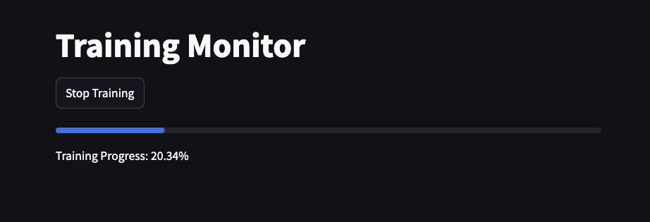

# training-follower

Streamlit app to help visualize the progress of training jobs.

The app itself is very simple but provides a working example for how to
extract data from the existing training logs in [instructlab/training](https://github.com/instructlab/training) and display the relevant data.

This logic can then be applied to more complex apps with prettier visuals.

Here's an example printout:





For the reference implementation, see: [`main.py`](./main.py).

### Installation

To properly install this, you should install the InstructLab training library (works on RHEL AI as well), 
and then simply update the `main.py` file to where you expect the saved checkpoints to be outputted to.

To install this demo, it's recommended to configure a virtual environment:

```bash
# create the venv
python -m venv venv

# activate the venv
source venv/bin/activate
```

With your environment configured, you may simply install the `requirements.txt` file:

```bash
pip install -r requirements.txt
```


### Running

With streamlit installed, you may simply start this app by running:

```bash
streamlit run main.py
```

This will launch a streamlit app which you can view in the browser.